# Pamana Adventures Project Proposal
## Where Culture Meets Adventure

## Logo:

## Description
Pamana Adventures, your ultimate travel companion for exploring the wonders of the Philippines. From pristine beaches and lush mountains to lively festivals and rich cultural heritage, our website is your one-stop tour guide through the islands’ destinations of the Pearl of the Orient Seas. Every journey is designed to connect you not only with stunning landscapes, but also with the stories, traditions, and history that make the Philippines one of a kind.

In our website you can explore regional tourist attractions, uncover hidden gems, foodie trips, and plan your adventures with helpful tips and interactive guides. Whether you’re a first-time traveler or a seasoned explorer, Pamana Adventures ensures every trip is meaningful, memorable, and full of cultural discovery. With Pamana Adventures, you can feel that it is truly more fun in the Philippines. 

******
## Webpage Breakdown:

- **Entry / Sign-Up Page (Onboarding Page):**
This page will serve as a required onboarding or loading page before users can access the Home Page. Users must complete a sign-up and personalization form to proceed. The form collects basic user information and travel preferences to personalize the website experience.

- **Home Page:** The home page will contain a menu that allows users to navigate to the five other web pages. It will feature an engaging background highlighting the beauty of a destination, a brief introduction to what the site offers.

- **P1 (Tourist Spots Overview):** This page will showcase an overview of the main tourist spots featured on the website. Each featured spot will include a short description, captivating images, and key information such as location, best time to visit, and must-see features.

- **P2 (Culture, Heritage, and History):** This page will discuss the different cultures, heritage and brief history of each tourist spot. It will provide insights into local traditions, festivals, customs, and historical landmarks that define the area’s identity.

- **P3 (Food and Recommendations):** This page will highlight the authentic flavors of the region by featuring local delicacies and signature dishes. It will also include restaurant recommendations, food stalls, and dining spots popular among locals and tourists alike. Each entry will include photos, short descriptions, and recipes.

- **P4 (Travel Guide and Contact Information):** This page will serve as a practical guide for travelers, offering information such as transportation options, accommodation tips, safety reminders, and budget-friendly travel advice. This page will also provide a travel guide and contact information for inquiries.

- **P5 (My Travel Profile):**
This page will display the user’s saved information and preferences gathered from the sign-up form, allowing users to review their personalized travel profile. This displays data linked to the currently logged-in account only, ensuring each user has their own private and personalized travel profile.

- **P6 (Personalized Recommendations):**
This page will automatically generate destination and activity recommendations based on the user’s saved travel preferences.

- **P7 (Sources):** The final page will list all the sources, references, and materials used in the creation of the website’s content. Proper citations will be included to acknowledge authors, photographers, and informational sites that contributed to the project’s development.

******
## JS Incorporation

### Sign-Up Page (Onboarding Page):

- **Form Validation:** Users must complete all required fields before proceeding to the home page.

- **Local Storage Usage:** User input will be stored using JavaScript Local Storage.

- **Redirect Function:** Upon successful submission, users are redirected to the Home Page.

- **Access Control Check:** Other pages will check if user data exists in localStorage and redirect users to the Sign-Up Page if no data is found.

- **Password Storage:** User passwords and profile data will be saved locally for educational purposes.

- **Login Validation:** The system will verify stored credentials before allowing access to personalized pages.

- **User-Specific Webpages:** Each logged-in user accesses their own saved travel profile and recommendations.

### Home Page:

- **Navigable Links:** The website will enable smooth navigation between all pages (Home, Tourist Spots, Culture, Food, Travel Guide, and Sources), ensuring a seamless user experience.

- **Slideshow Banner:** An automated slideshow will highlight featured destinations such as Palawan, Siargao, and the Banaue Rice Terraces. Users will also have the option to manually navigate through the images using arrows for better control.

### Tourist Spots Overview:

- **Interactive Philippine Map:** The centerpiece of this page will be a clickable map of the Philippines. Each region or location marker will function as a clickable button. Clicking a region will redirect users to a dedicated section or subpage showcasing tourist spots in that area.

- **Destination Slideshow:** For regions like Palawan, users can view a slideshow featuring multiple attractions, such as El Nido, Coron, and the Puerto Princesa Underground River.

- **Fun Fact Pop-ups:** Select tourist spots will include clickable icons. Clicking an icon will trigger a pop-up with fun facts or trivia, such as the formation of stalagmites in Puerto Princesa.

### Culture, Heritage, and History Page:

- **Interactive Image Zoom:** Clicking on images of cultural sites or heritage events will zoom in on the image and display a detailed description, providing users with information about the history, traditions, and cultural significance of each location.

### Food Recommendations Page:

- **Rotating Plate Slideshow:** This page will feature a dynamic slideshow where regional dishes from Luzon, Visayas, and Mindanao appear on a virtual plate. Users can slide left or right to view different dishes. JavaScript and CSS transitions will animate the plate to create a smooth rotating effect between dishes.

- **Interactive Filtering:** Content updates instantly when checkboxes are selected or deselected.

- **Preference Syncing:** Selected filters can update and synchronize with saved user preferences.

- **DOM Manipulation:** Shows food and restaurant recommendations without page reload.

### Travel Guide Page:

- **Expandable Tip Categories:** Travel tips will be organized into categories such as Budget Travel, Safety Tips, Packing Essentials, and Local Etiquette. Each category will appear as a collapsible panel; clicking will smoothly expand the section to reveal related tips, and collapse when clicked again. 

- **Hover Animations:** Category boxes will respond to hovering with subtle color changes, shadow effects, and a slight lift, indicating that they are clickable.

### Travel Profile Page 

- **Data Retrieval:** Retrieves user profile and preference data from localStorage.

- **Dynamic Content Display:** Automatically populates profile fields (name, email, preferences) without manual input.

- **Edit Option:** Allows users to update their preferences, overwriting previous data in localStorage.

- **State Persistence:** Any updates remain saved even after refreshing or reopening the website.

### Personalized Recommendations Page

- **Preference Matching Logic:** Compares user-selected preferences with predefined tags assigned to destinations and food items. This would utilize the given fields in the sign-up form given during the loading page.

- **Scoring System:** Assigns a simple match score to each item based on shared preferences.

- **Dynamic Rendering:** Displays only the top-matching destinations and food recommendations.

 - **Contextual Labels:**  Adds indicators such as “Highly Recommended” or “Recommended for You” based on match scores.

 - **Visual Rating Indicators:** Tourist spots will display simple visual ratings (e.g., stars or labels) based on preference match scores.

### Sources Page:

- **Interactive Links:** All sources and references used to create the website will be listed on this page. Hovering over a link will trigger a color change to indicate interactivity.

******
## HTML Form Incorporation

### Sign-Up Form

**Form Design and Purpose:**
The website will implement a comprehensive Sign-Up and Travel Preference Form. This form allows users to input personal travel details and preferences in a single interaction. The purpose of the form is to create a basic traveler profile that enables personalized content across multiple webpages.

To enhance the user experience, Pamana Adventures will implement a basic user account system through the help of the sign-up form. During the sign-up process, users will create an account with their email and password. Account information and preferences will be securely saved locally. This allows users to log in on return visits and access their own personalized pages, including their Travel Profile and Personalized Recommendations. Each account is unique, ensuring that every user sees content tailored specifically to their preferences and interests.

**Form Elements to be Used:**
- Text input (Name)
- Email input (Email address)
- Dropdown menu (Preferred travel region)
- Checkboxes (Travel interests)
- Radio buttons (Food preference)
- Range slider or dropdown (Budget range)
- Checkbox (Terms and conditions)
- Submit button

Form data will be stored locally using JavaScript and reused across multiple webpages which are the Home Page, Tourist Spots (showing the ratings) Page, and Personalized Reccomendations Page.

### Food Preference Filter Form

A secondary form will be embedded in the Food Reccomendations page. This form allows users to temporarily filter displayed content using checkboxes and dropdowns without permanently altering stored user data.

******
## Wireframe
******
### Sign-Up Form:
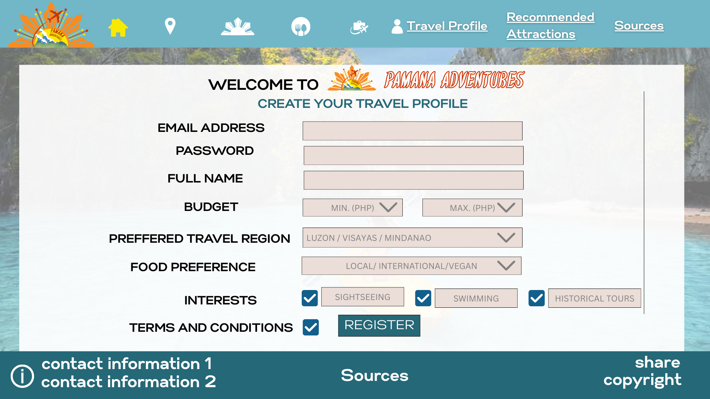
#### Home Page:
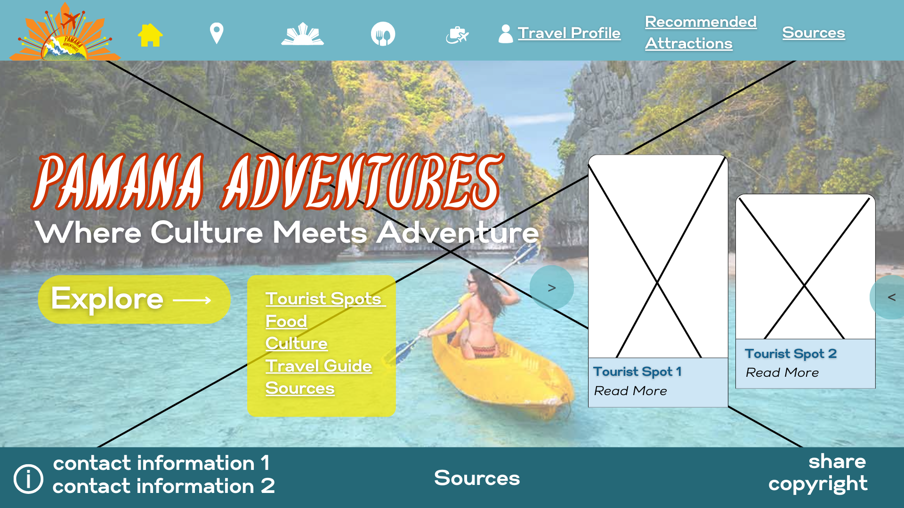
#### Tourist Spots:
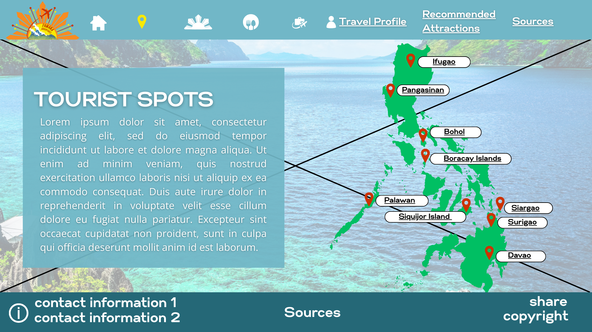
When the location icon is clicked:
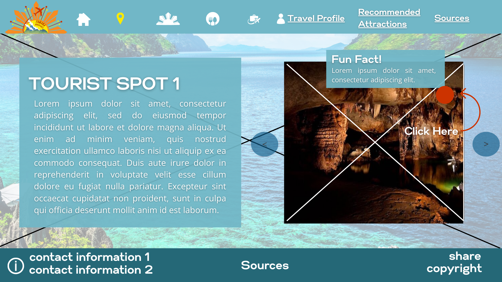
#### Culture:
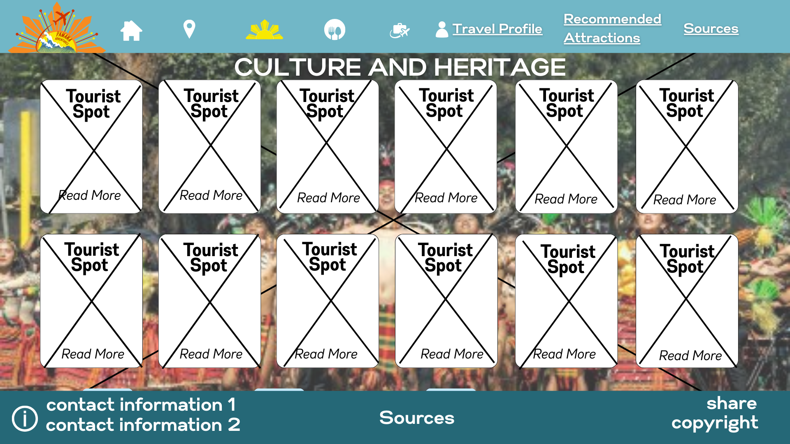
When the image is clicked:
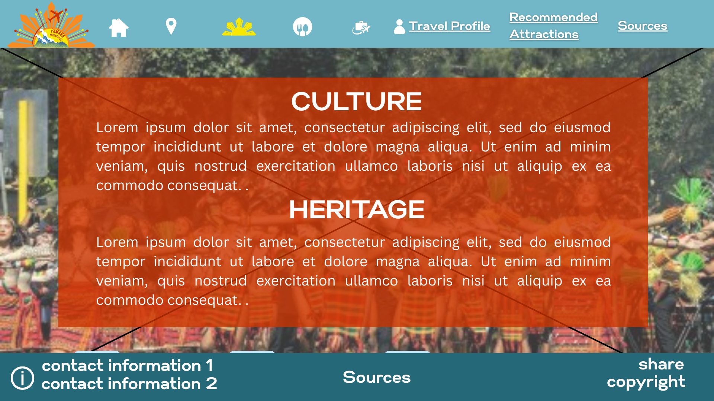
#### Food Recommendations:
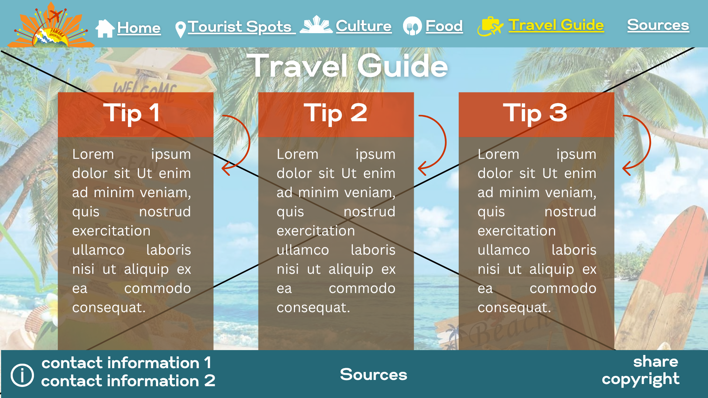
#### Travel Guide:
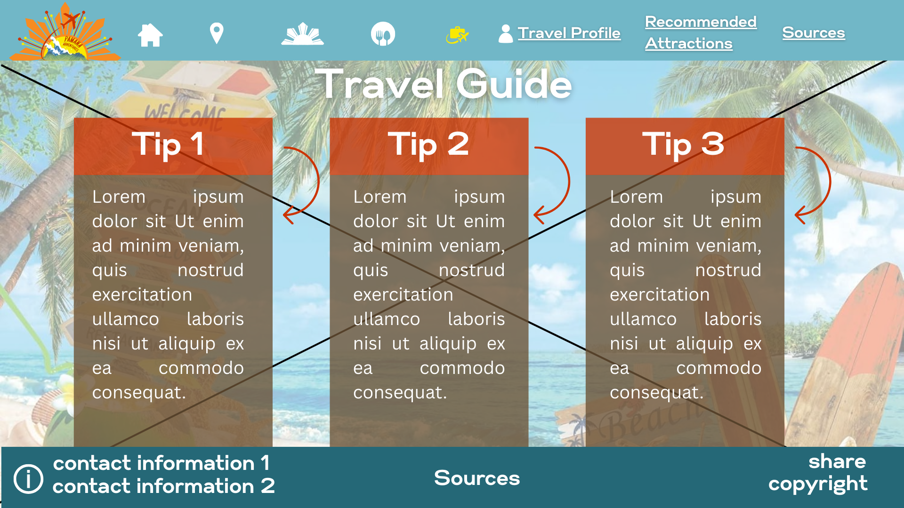
#### Travel Profile:
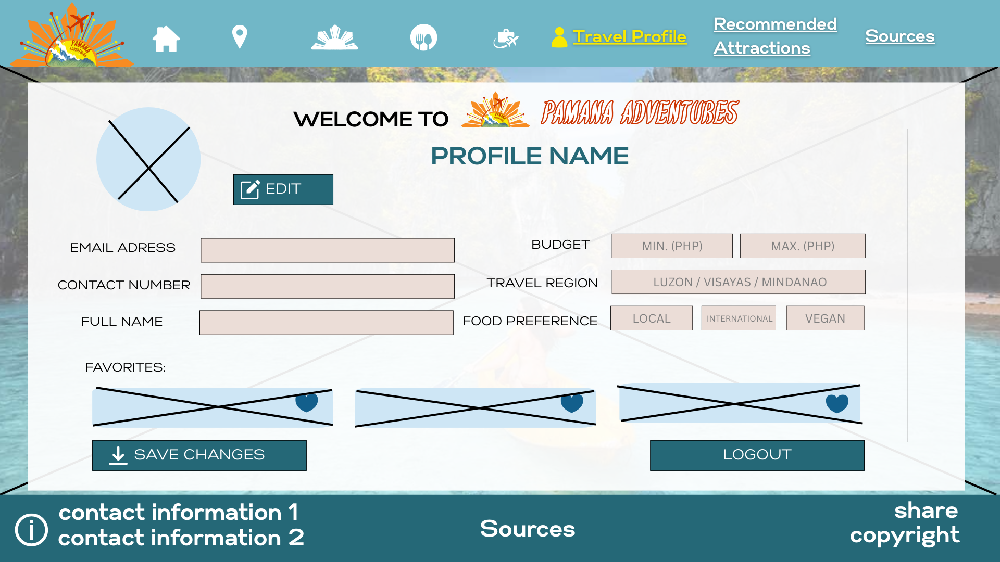
#### Recommended Attractions:
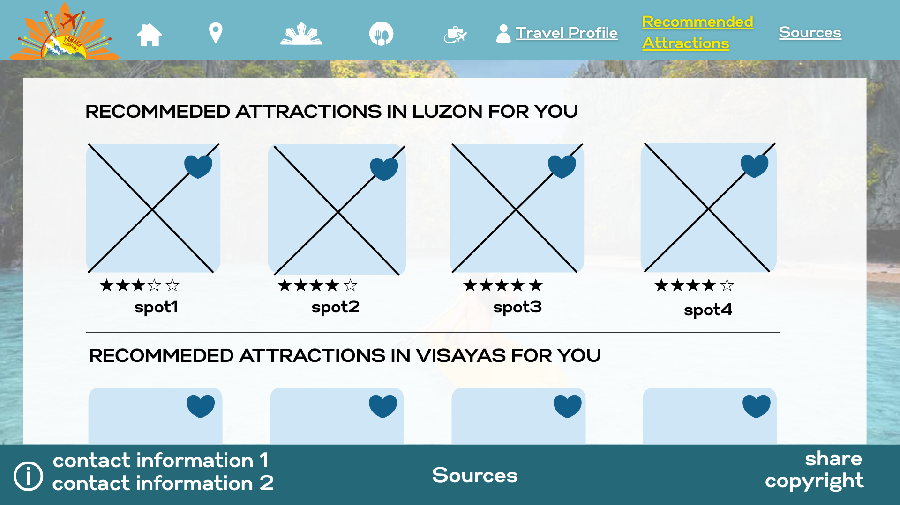
#### Sources:
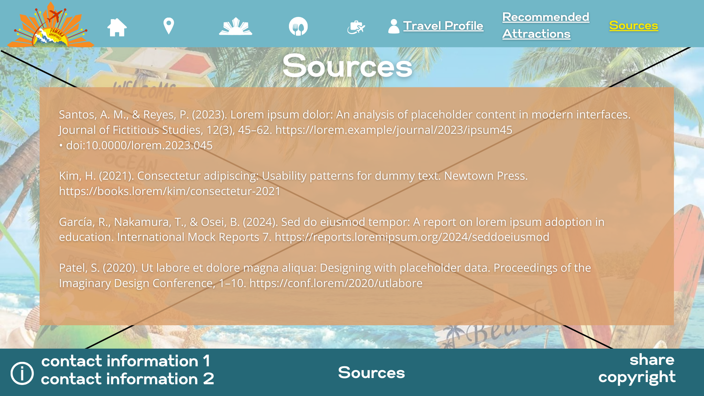